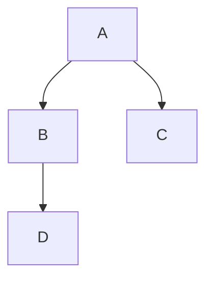

# Markdown

只有干货没有废话.
## 标题

```markdown
# 一级标题
## 二级标题
### 三级标题
#### 四级标题
##### 五级标题
###### 六级标题
```
> # 一级标题
> ## 二级标题
> ### 三级标题
> #### 四级标题
> ##### 五级标题
> ###### 六级标题

## 字体

| 代码 | 效果 |
| :--: | :--: |
|`*这是斜体*`|*这是斜体*|
|`_这是斜体_`|_这是斜体_|
|`**这是粗体**`|**这是粗体**|
|`__这是粗体__`|__这是粗体__|
|`***这是粗斜体***`|***这是粗斜体***|
|`___这是粗斜体___`|___这是粗斜体___|

> 加粗Ctrl+B
> 斜体Ctrl+I
> 下划线Ctrl+U
> 删除线Alt+Shift+5
> `<br/>` 换行

## 引用

```markdown

>这是一个引用：
>>这是一个引用的引用
>>>这是一个引用的引用的引用

```
效果:
>这是一个引用：
>>这是一个引用的引用
>>>这是一个引用的引用的引用

## 链接

```markdown
[链接名称](链接地址)
即是：
[这是brad的主页](https://zbzlf120.github.io/)
或者
<https://zbzlf120.github.io/>

```
效果:
[这是brad的主页](https://zbzlf120.github.io/)
<https://zbzlf120.github.io/>

## 图片

```markdown


```

效果:


## 脚注

```markdown
使用 Markdown[^1]可以效率的书写文档, 直接转换成 HTML[^2], 你可以使用 Typora[^T] 编辑器进行书写。
[^1]:Markdown是一种纯文本标记语言
[^2]:HyperText Markup Language 超文本标记语言
[^T]:NEW WAY TO READ & WRITE MARKDOWN.

```

效果:
使用 Markdown[^1]可以效率的书写文档, 直接转换成 HTML[^2], 你可以使用 Typora[^T] 编辑器进行书写。
[^1]:Markdown是一种纯文本标记语言
[^2]:HyperText Markup Language 超文本标记语言
[^T]:NEW WAY TO READ & WRITE MARKDOWN.

## 特殊符号

对于Markdown中的语法符号，前面家反斜线\即可以显示符号本身。
```markdown
\\
\*
\_
\+
\.
等等
```

## 高级用法

1. 制作代办项

```markdown
- [ ] 支持以 PDF 格式导出文稿
- [ ] 改进 Cmd 渲染算法，使用局部渲染技术提高渲染效率
- [x] 新增 Todo 列表功能
- [x] 修复 LaTex 公式渲染问题
- [x] 新增 LaTex 公式编号功能

```

效果:
- [ ] 支持以 PDF 格式导出文稿
- [ ] 改进 Cmd 渲染算法，使用局部渲染技术提高渲染效率
- [x] 新增 Todo 列表功能
- [x] 修复 LaTex 公式渲染问题
- [x] 新增 LaTex 公式编号功能

2. 公式书写

`$$`表示整行公式

`$$E=mc^2$$`
效果:
> $$E=mc^2$$

3. 绘制流程图


